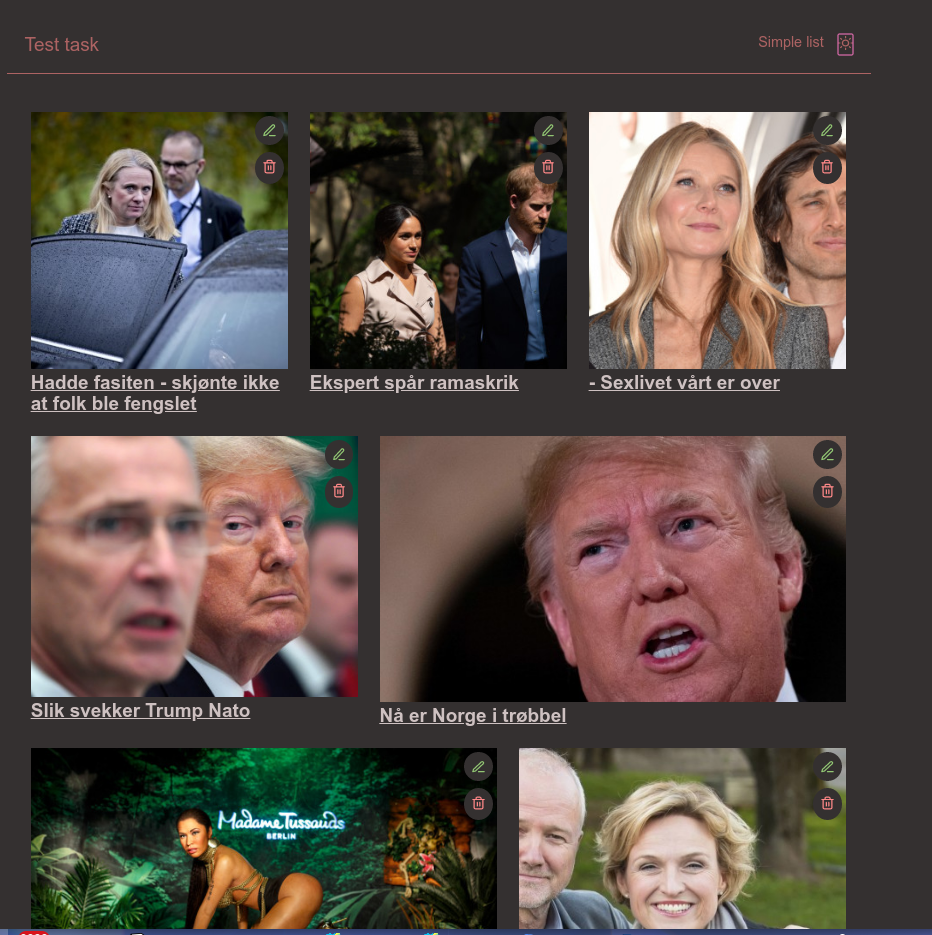

Built with Next.js, Emotion Styled Components, to manage state used Redux, with Redux Toolkit

# Interview Task
The provided URL returns JSON, which contains an array of objects representing
rows. Each row has a field, columns, which contains an array of objects representing
article previews. In effect, the provided JSON is a simplified representation of the
Dagbladet front page. We would like you to create a React application that makes a
request to the provided URL, and renders the rows and articles in accordance with
the JSON response.
Each article should have an edit button which swaps out the title with an input field
that allows the user to edit and save the title. In addition to the edit button, there
should be a delete button that deletes the article. When an article is deleted, show a
prompt for a few seconds that allows the user to restore the last deleted article.
Backend URL: ​ https://storage.googleapis.com/aller-structure-task/test_data.json
## Additional Details
The following is an example of a row that appears in the response. The width is
based on a 12-column grid. A width of 5, therefore, implies that this article should be
5/12ths of the body width. The other article has a width of 7, meaning it takes up the
remaining 7/12ths of the body width. All rows will have a width that sums to 12.
For imageUrl, the height and width of the image can be modified by adding
&height=X and/or &width=X to the URL.The other fields are hopefully self-explanatory.
## Bonus Task
Create two separate routes (or pages if you will), one that shows the full articles with
images using the rows and columns grid explained in the JSON structure, and
another route that only shows a simple one column list containing article titles. Make
sure the browser does not download any unused JavaScript files on the given
routes.